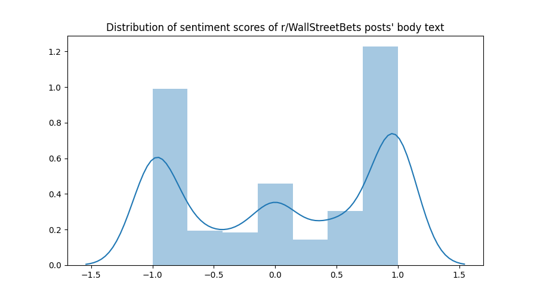
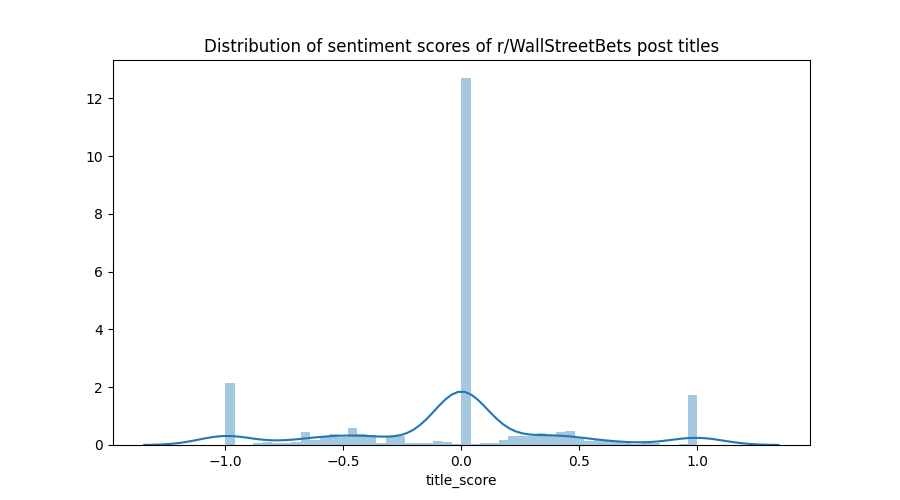
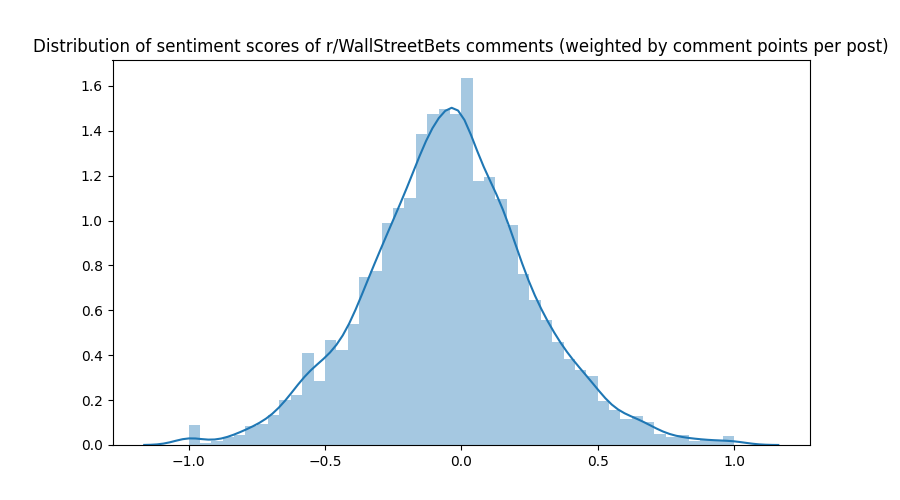

# Sentiment analysis of r/wallstreetbets, Robinhood users, and equity prices

[Working doc](https://docs.google.com/document/d/1gxtnKA8kYnErLlQG9D1arkF0PyiTmxI0CQyOZFLH4Tw/edit?ts=5f38399a)

## Sentiment scores

