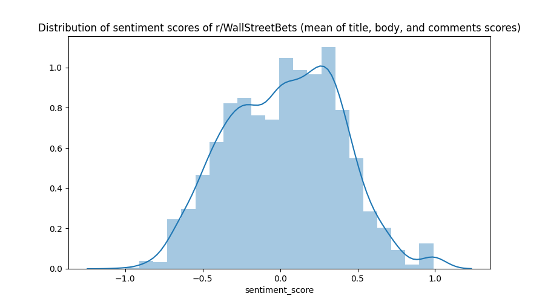
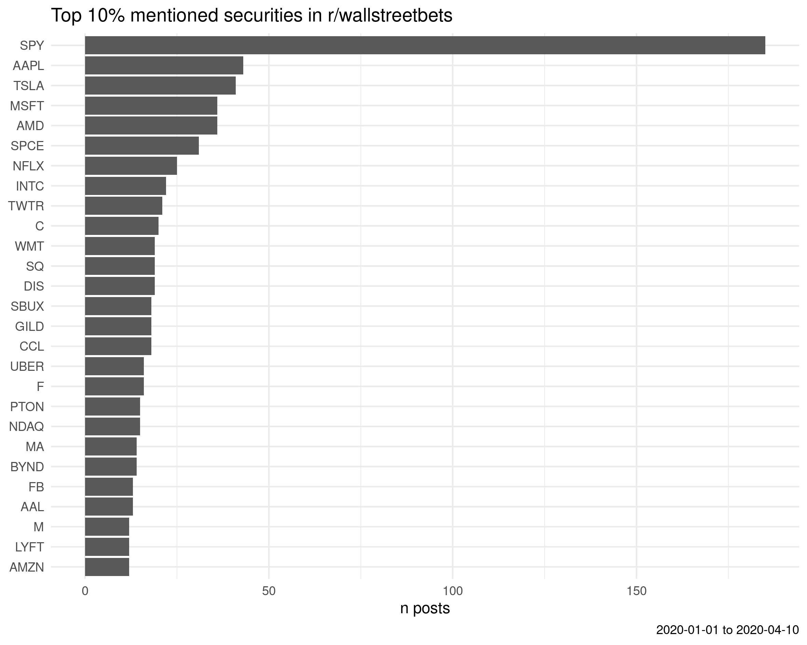

# Sentiment analysis of r/wallstreetbets and Robinhood users

Examining the link between [r/wallstreetbets](https://www.reddit.com/r/wallstreetbets/) commentary and [Robinhood](https://robinhood.com/us/en/) usage using [Bayesian multi-level modeling](https://bookdown.org/ajkurz/Statistical_Rethinking_recoded/multilevel-models.html).

[Working doc](https://docs.google.com/document/d/1gxtnKA8kYnErLlQG9D1arkF0PyiTmxI0CQyOZFLH4Tw/edit?ts=5f38399a)

## Sentiment scores

  

  

  

# Other

  

