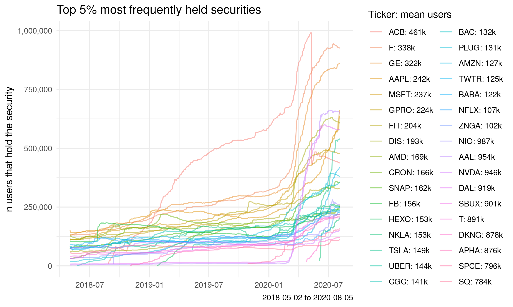

# Sentiment analysis of r/wallstreetbets and Robinhood users

Examining the link between [r/wallstreetbets](https://www.reddit.com/r/wallstreetbets/) commentary and [Robinhood](https://robinhood.com/us/en/) usage using [Bayesian multi-level modeling](https://bookdown.org/ajkurz/Statistical_Rethinking_recoded/multilevel-models.html).

See blog post: [marlo.works/posts/stonks/](https://joemarlo.github.io/posts/stonks/)

## Sentiment scores

  

  

  

## Robinhood usage

  

  

