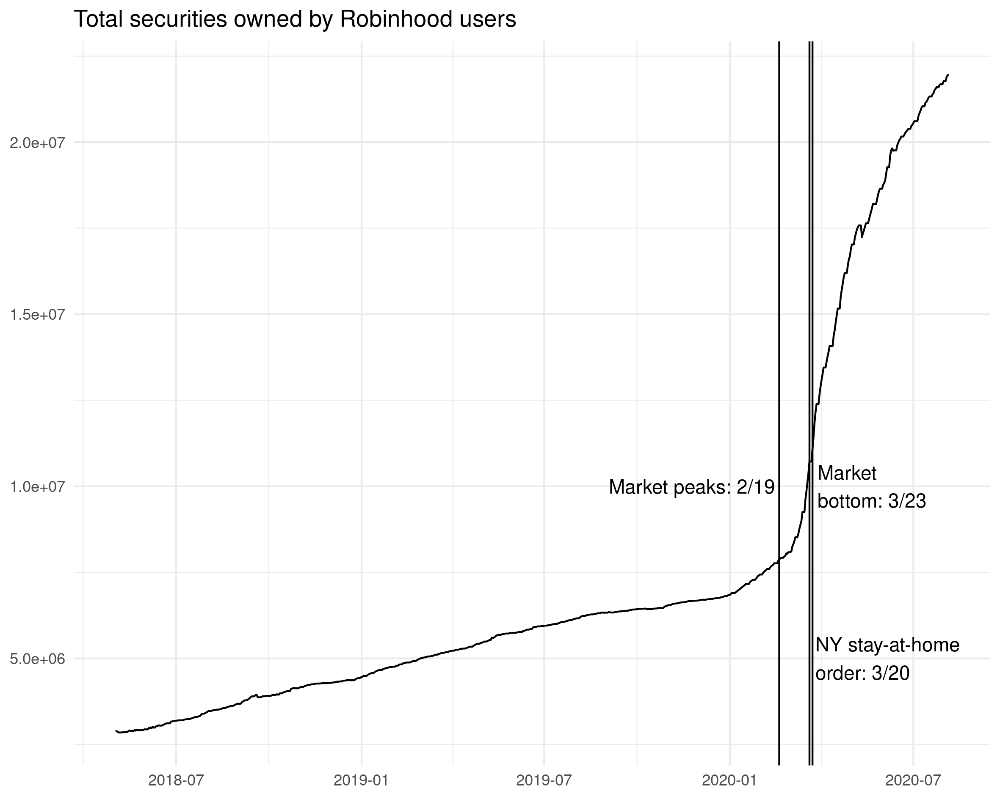
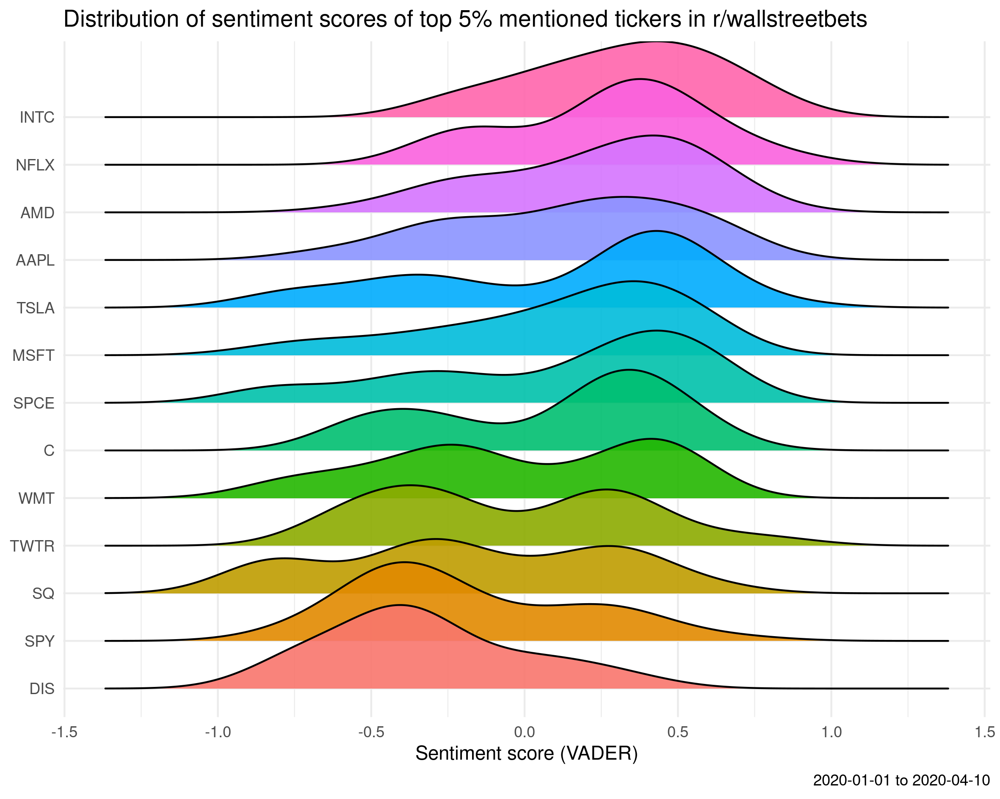
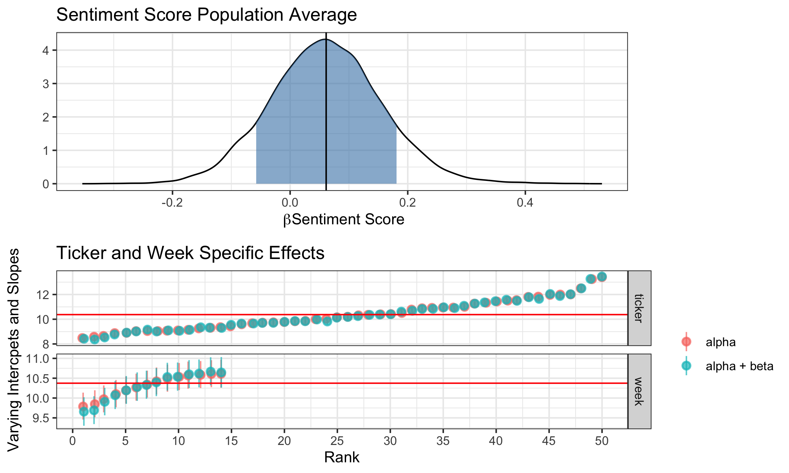

```{r setup, include=FALSE}
knitr::opts_chunk$set(echo = TRUE)
```

### The Rise of Robinhood

Amid the economic uncertainty, increased time spent at home and $1,200 stimulus checks, the spring and summer of 2020 witnessed noticeable increases in retail stock and ETF trading. The majority of this rise has taken place on the popular trading app [Robinhood](https://robinhood.com/us/en/), which allows retail traders to trade commission-free. 




The rise of retail trading, much of which has occurred on Robinhood, shook the market with seemingly irrational trades such as a [large number of retail traders buying assets in Hertz after the company's filed for bankruptcy](https://www.forbes.com/advisor/investing/robinhood-bankrupt-hertz/). As retail investors become more relevant to market insight, the popular subreddit r/wallstreetbets (WSB), which described itself as "Like 4chan found a Bloomberg Terminal", has received increasing attention as a source of information to explain the mindset of retail traders. As of today, the subreddit has over 1.5 million followers and has been described by a [Bloomberg piece](https://www.bloomberg.com/news/articles/2020-09-15/big-investors-are-dying-to-know-what-the-little-guys-are-doing) as a must read to understand the mindset of retail traders. 

### Research question

Several cases of mainstream financial reporting imply a link between WSB and Robinhood users, however, this link has been largely anecdotal or based on a selected number of single cases. The extent to which discussions on WSB predicts changes in the number of Robinhood users holding particular stocks — or stonks, following WSB vernacular — remains an open question. Put another way, if I know a given stock was talked about today on WSB does that improve my predictions about how many Robinhood Users will hold that stock? 


### Analysis

To identify which tickers were discussed on WSB, all posts to the Daily Discussion section from March 1 through June 1, were scraped from Reddit. WSB posts were then merged with data on the number of Robinhood users holding each security. Robinhood data was obtained from the website [Robbin Track](https://robintrack.net) which obtains Robinhood usage data from the Robinhood API. The final data set includes daily counts of the number of Robinhood users holding the top 400 tickers for all days from March 1 - June 1 and a binary indicator representing if each ticker was discussed on WSB. 

After creating the data set, Bayesian Negative Binomial Mixed-Effects models were used to test if a post on WSB about a given ticker predicts changes in the amount of Robinhood users holding that ticker. Several possibilities exist for modeling the relationship between WSB and a ticker's popularity on Robinhood.[Leave One Out Cross Validation (LOO)](http://www.stat.columbia.edu/~gelman/research/unpublished/loo_stan.pdf) was used to inform model selection. It is possible that the predictive power of WSB may vary between different tickers and could also change over time. The model is flexible enough to account for these possibilities by including a fixed effect for WSB along with random effects for ticker and week that allow the effect of WSB to differ across ticker and over time. 

Results from the model are presented in the figure below. The top section of the figure indicates that, on average, knowing that a ticker was posted about on WSB does not provide substantial predictive information on the number of Robinhood users holding that ticker. The negative mean of the WSB variable actually suggests that WSB is more likely to be associated with decreased popularity on Robinhood, however, there is too much uncertainty (represented by the shaded blue) to make a firm conclusion about the direction.

The bottom portion of the figure presents week- and ticker-specific effects of WSB. Red points reflect predictions without WSB, while blue points include the WSB variable. The red line across the figure represents the average Robinhood popularity across tickers and across weeks. Taken together, there is clear evidence that some tickers are more popular than others and that the popularity of tickers changes over time, however, posts on WSB do not appear to predict changes in the popularity of a given ticker among Robinhood users. 


### Considering sentiment 

A weakness of the analysis described above is that it assumes all posts on WSB carry equal weight. This is a tenuous assumption. Some posts on WSB are explicitly bullish while others are explicitly bearish. Sentiment analysis can be used to get a more nuanced representation of how a given ticker is being discussed at a particular point in time. By creating a WSB specific content dictionary and using the social media designated sentiment analysis algorithm [VADER](http://comp.social.gatech.edu/papers/icwsm14.vader.hutto.pdf) the valence of each WSB post can be taken into account. Scores above zero indicate more positively while scores below zero represent more negative sentiment. Sentiment scores of the top tickers mentioned on WSB confirm that tickers have a balance of both positive and negative posts.



It is possible that tickers discussed more positively on WSB are more likely to coincide with increased popularity on Robinhood. To test this, all tickers that were discussed on WSB were compared using their sentiment score as a predictor for Robinhood popularity. Another Negative Binomial Bayesian Mixed-Effects model was fit. This model included a fixed effect for sentiment score, along with random effects for week and ticker and varying slopes for sentiment score for both week and ticker. This model produces an average effect for sentiment score while also allowing the effect of sentiment score to vary over time and to vary between tickers.

Results from the second model are summarized in the figure below. The population average effect of sentiment score suggests that, on average, knowing the sentiment of a WSB post does not substantially improve the ability to predict changes in the popularity of a ticker. The trend of sentiment score suggests that a positive sentiment is more likely to predict increased popularity, however, there is too much uncertainty (shown by the shaded blue region) to reach a firm conclusion about the direction of sentiment. 

The bottom section of the figure presents ticker and week specific effects. The lack of difference between red points (which do not include sentiment as a predictor) and blue points (which factor in sentiment score) suggest that including information about sentiment does not provide strong evidence of changes in Robinhood popularity. Again, the red line represents the average Robinhood popularity across tickers and across weeks. There is clear evidence that some tickers are more popular than others and that the number of Robinhood changes over time, however, there is little difference between sentiment scores. 




### Takeaway and limitations

In total these two analyses suggest that the link between a ticker's popularity on WSB and a ticker's popularity on Robinhood is highly uncertain. This contrasts the prevailing media narrative. On average, knowing that a specific ticker was posted about on WSB and knowing the sentiment of a given post does not provide evidence that is strong enough to make actionable predictions about a ticker's popularity on Robinhood. 

These findings need to be considered in light of several key limitations:

First, these analyses are not designed to evaluate any causal links between WSB and Robinhood, instead these analyses have been centered around using WSB to predict popularity on Robinhood. While these two constructs, cause and prediction, appear similar there are important distinctions between to two. For more detail on these distinction, refer to the book [Regression and Other Stories](https://avehtari.github.io/ROS-Examples/) 

Second, all analyses were focused on the number of users holding a given ticker rather than the amount of total assets invested. It is possible that WSB predicts high volume investing but not widespread popularity. 

Third, our data set only included data from the 400 most popular tickers on Robinhood and analyses were conducted on a stratified random sample of those ticker (strata based on ticker popularity). This sampling approach was required for computational feasibility. WSB may be more predictive of lesser known and more unpopular tickers not included in the 400 most popular tickers.

Finally, our models assume that any effect of a post to WSB is limited to the day of that post. It is possible that posts on WSB may predict longer term changes in Robinhood popularity and these changes would not be reflected in our model. 

For a more detailed view of this analysis, I invite you to look at the full code available on my github. 

